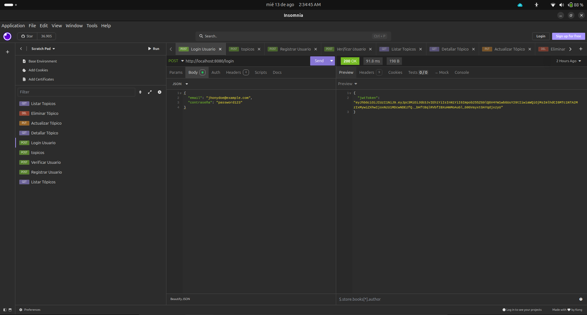

#  API REST - Foro Hub 🚀


## 📋 Descripción del Proyecto



**Foro Hub** es una API RESTful robusta y segura, desarrollada como solución al challenge final de la formación **Backend en Java de Alura Latam y Oracle (ONE)**. La API permite a los usuarios gestionar un foro de discusión, implementando un sistema completo de operaciones CRUD (Crear, Leer, Actualizar, Borrar) para los tópicos, con un enfoque principal en la seguridad y las buenas prácticas de desarrollo backend.

Este proyecto simula el backend que podría dar soporte a una plataforma de foro interactiva, gestionando la persistencia de datos en una base de datos PostgreSQL y protegiendo los endpoints a través de un esquema de autenticación basado en **JSON Web Tokens (JWT)**.

---

## 🎥 Funciones Importantes de la API


1.  **Autenticación:** Un usuario envía sus credenciales al endpoint `/login`.
2.  **Obtención de Token:** La API valida las credenciales y devuelve un token JWT.
3.  **Petición Protegida:** Se utiliza el token JWT para realizar una petición `POST` al endpoint `/topicos`, creando un nuevo tema de discusión.
4.  **Verificación:** Se realiza una petición `GET` a `/topicos` para listar los temas existentes, demostrando que el nuevo tópico fue guardado con éxito.

---

## ✨ Características y Funcionalidades

*   **Autenticación JWT:** Implementación de un sistema de seguridad stateless. Los usuarios obtienen un token al hacer login, el cual debe ser enviado en el header `Authorization` para acceder a los endpoints protegidos.
*   **CRUD Completo de Tópicos:**
    *   `POST /topicos`: Crear un nuevo tópico (protegido).
    *   `GET /topicos`: Listar todos los tópicos activos con **paginación y ordenamiento**.
    *   `GET /topicos/{id}`: Obtener los detalles de un tópico específico.
    *   `PUT /topicos/{id}`: Actualizar un tópico existente (protegido).
    *   `DELETE /topicos/{id}`: Eliminar un tópico (borrado lógico, protegiendo la integridad de los datos).
*   **Gestión de Usuarios:** Incluye un endpoint temporal (`POST /login/registrar`) para la creación de usuarios de prueba.
*   **Validación de Datos:** Utiliza `Jakarta Bean Validation` para asegurar la integridad de los datos de entrada en los DTOs.
*   **Gestión de Errores Centralizada:** Implementa un `ControllerAdvice` para manejar excepciones de forma consistente y devolver respuestas de error claras y estandarizadas.
*   **Migraciones de Base de Datos con Flyway:** El esquema de la base de datos es versionado y gestionado a través de scripts de migración, asegurando consistencia entre entornos.

---

## 🏛️ Arquitectura y Diseño

El proyecto está construido siguiendo una arquitectura por capas, un pilar del diseño de software robusto, para garantizar una clara separación de responsabilidades:``
  

/com/alurachallenge/forohub  
├── controller/ # Capa de Presentación: Recibe peticiones HTTP y maneja las respuestas.  
├── domain/ # Capa de Dominio: Contiene las entidades, DTOs y la lógica central del negocio.  
│ ├── topico/  
│ └── usuario/  
├── infra/ # Capa de Infraestructura: Soporte técnico como seguridad, configuración externa, etc.  
│ └── security/  
├── repository/ # Capa de Persistencia: Interfaces de Spring Data JPA para el acceso a datos.  
└── service/ # Capa de Servicio: Orquesta la lógica de negocio, actuando como intermediario.


## 🛠️ Tecnologías Utilizadas

| Tecnología | Propósito |
| :--- | :--- |
| **Java 17** | Lenguaje de programación principal. |
| **Spring Boot 3** | Framework para la creación de la aplicación y gestión del ciclo de vida. |
| **Spring Security** | Para la implementación de la autenticación y autorización. |
| **JWT (jjwt)** | Biblioteca para la creación y validación de JSON Web Tokens. |
| **Spring Data JPA** | Para la persistencia de datos y la interacción ORM con la base de datos (Hibernate). |
| **PostgreSQL** | Sistema Gestor de Base de Datos relacional. |
| **Flyway Migration**| Herramienta para el control de versiones del esquema de la base de datos. |
| **Maven** | Gestor de dependencias y construcción del proyecto. |
| **Lombok** | Para reducir código repetitivo (getters, setters, constructores) en el modelo. |
| **Validation** | Para la validación de los datos de entrada. |

---

## ⚙️ Instalación y Uso

Para ejecutar este proyecto en tu entorno local:

1.  **Clonar el repositorio:**
    ```bash
    git clone https://github.com/jhonyaldo/g8forohubjr.git
    cd g8forohubjr
    ```

2.  **Configurar la Base de Datos:**
    *   Asegúrate de tener **PostgreSQL** instalado y en ejecución.
    *   Crea un usuario y una base de datos dedicada. Ejemplo en `psql`:
        ```sql
        CREATE USER forohub_user WITH PASSWORD 'tu_contraseña';
        CREATE DATABASE foro_hub OWNER forohub_user;
        ```

3.  **Configurar las Variables de Entorno:**
    *   Este proyecto utiliza variables de entorno para las credenciales de la base de datos y el secreto de JWT, una práctica de seguridad fundamental.
    *   En tu IDE (ej. IntelliJ IDEA), ve a `Edit Configurations...` y añade las siguientes variables de entorno:
        *   `DB_USER` = `forohub_user`
        *   `DB_PASSWORD` = `tu_contraseña`
        *   `JWT_SECRET` = `tu_frase_secreta_larga_y_compleja`

4.  **Ejecutar la aplicación:**
    *   La primera vez que ejecutes, Flyway creará automáticamente las tablas en la base de datos.
    *   Ejecuta el método `main()` en `ForohubApplication.java` desde tu IDE.

5.  **Probar la API:**
    *   Usa un cliente REST como [Insomnia](https://insomnia.rest/) o [Postman](https://www.postman.com/).
    *   Crea tu primer usuario con `POST /login/registrar`.
    *   Obtén tu token con `POST /login`.
    *   Usa el token para probar los endpoints protegidos de `/topicos`.

---

## 👨‍💻 Autor

**Jhony A. Rodriguez Melendez**

*   **Correo:** [jhonyaldo@gmail.com](mailto:jhonyaldo@gmail.com)
*   **LinkedIn:** [https://www.linkedin.com/in/jhonyrm/](https://www.linkedin.com/in/jhonyrm/)
*   **GitHub:** [https://github.com/jhonyaldo](https://github.com/jhonyaldo)

---

